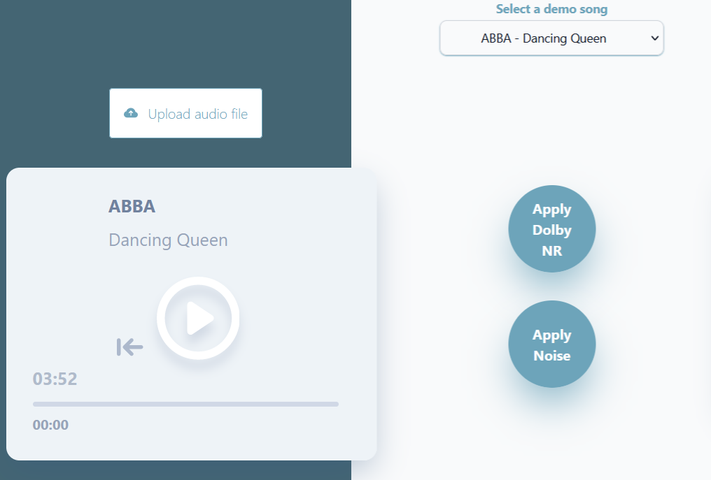

# Wiener DOLBY-NR

JS libraries used: 
+ **music-metadata-browser** (https://www.npmjs.com/package/music-metadata-browser),

Python libraries used: 
+ **Flask** (https://flask.palletsprojects.com/en/3.0.x/),
+ **Soundfile** (https://github.com/bastibe/python-soundfile/tree/0.11.0)
+ **NumPy** (https://numpy.org/)
+ **SciPy** (https://scipy.org/)

### Project Setup
To make sure the tool works properly, run the python backend first ("app.py"), after installing the previously listed libraries.

```sh
pip install soundfile
pip install Flask
pip install scipy
pip install numpy
```

## General Introduction

Wiener-DolbyNR tries to obtain an effect similar to the popular Dolby Noise Removal system by implementing a Wiener filtering inspired process.<br/>


Clean demo songs are provided through a drop-down menu, the user has the choice to upload their own audio file as well.<br/>
Two players are present in order to play the selected song (on the left) and the denoised file (to the right).<br/><br/>
At the center of the page two buttons are available: one to apply and remove the tape hiss to the uploaded song, the other to perform the processing required to denoise the song.<br/>
The denoising process is performed on the python backend of the tool, using Flask to allow for the communication between the two sections.<br/><br/>
At the bottom of the page there's a section dedicated to the artificial noise that is added to the clean track. This is necessary in order to 
simulate the tape hiss we want to eliminate during the wiener filtering process.

<p>
  
  <br/>
  <br/>
  <br/>
  The theme of the operating system (dark/light) is automatically detected and the colors
  of the tool are displayed accordingly, this is automated by performing a media query on the window in which the program is running. 
  The theme can be changed at any time by clicking the moon/sun icon present in the top right corner.
</p>

<br clear="left"/>
<br clear="left"/>

Starting from a clean track and a known noisy process, it extracts a denoised version:


## Noise Parameters

The noise section allows to user to control the tape hiss added to the clean song.
It can be customized by modifying these paramaters:
+ **Noise Generator**
  - **White Noise**: white noise generated for the tape hiss simulation
    - *Gain*: amplitude of the white noise
  - **High Pass Filter** (*createBiquadFilter(type=highpass)*): better emulates the high frequency nature of tape hiss
    - *Frequency*: cutoff frequency for the HP filter
    - *Gain*: output over input ratio of the filter

This section was implemented through the use of the **WebAudioAPI**.
